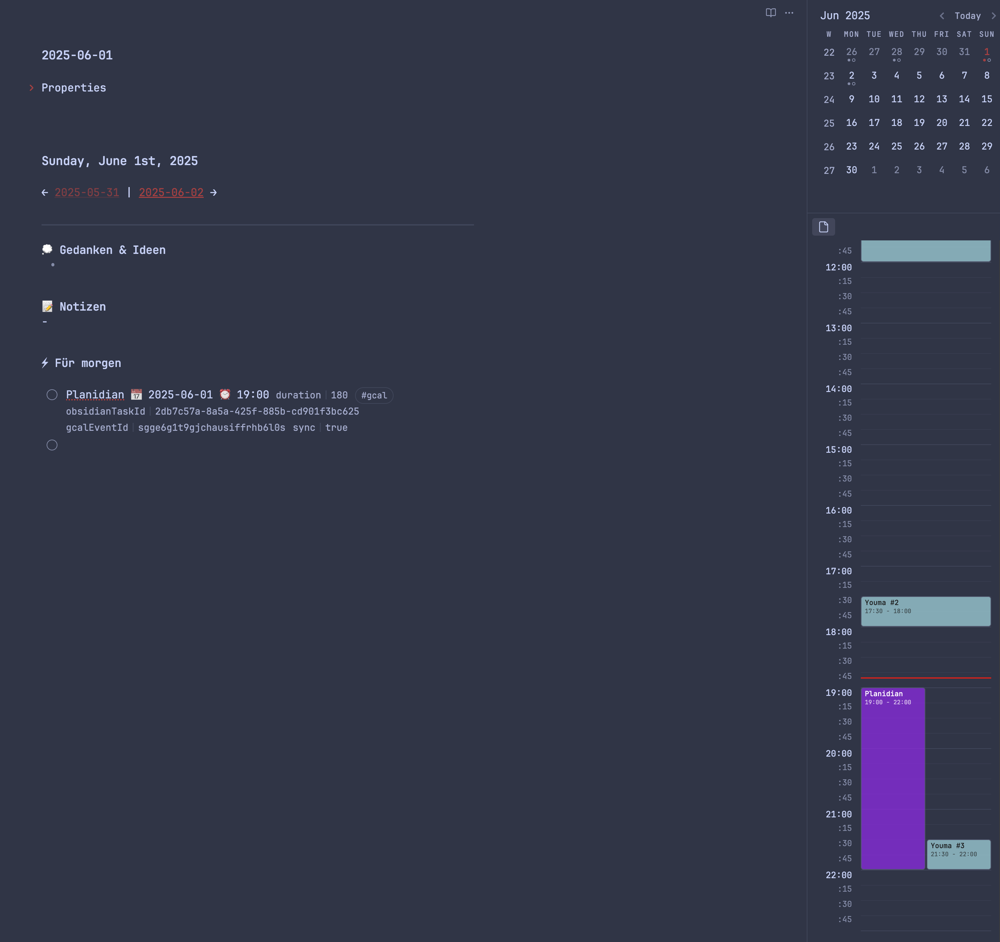
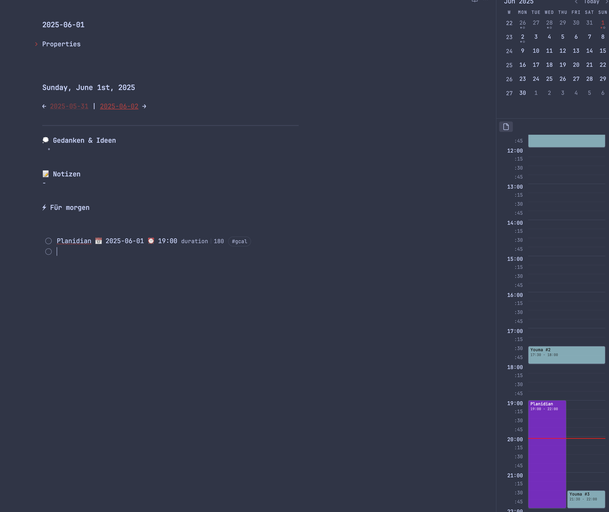

# PlanSyncGo for Obsidian

Welcome to PlanSyncGo! This plugin for Obsidian helps you plan your day by displaying your Google Calendar events as a visual timeline directly within Obsidian and enabling synchronization of your Obsidian tasks with your Google Calendar.

## Screenshots

# With IDs

## Features

* **Google Calendar Integration:**
    * Secure authentication via OAuth 2.0.
    * Support for a primary and optionally a secondary (work) calendar.
    * Automatic token renewal.
* **Sidebar Timeline View:**
    * Graphical, block-based timeline for the date of the active daily note.
    * Configurable start and end hours.
    * 15-minute grid lines and labels for detailed planning.
    * Automatic layout adjustment for overlapping events.
    * Red line indicator for the current time (on the current day only).
    * Configurable colors for different event types.
    * Creates the view directly below the Calendar plugin.
    * If the Calendar Plugin is not installed, the Timeline will be in its own side panel.
* **Task Synchronization (2-way, with Obsidian as the source of truth for content/time):**
    * Synchronize Obsidian tasks with Google Calendar (create, update, delete).
    * Task detection via the Obsidian Tasks Plugin (recommended) or manual parsing.
    * Support for sync tags (e.g., `#gcal`), date (`📅YYYY-MM-DD`), time (`⏰ HH:MM`), and duration (`[duration::NNN]`) specifications.
    * If an event created by PlanSyncGo is deleted in Google Calendar, the linked Obsidian task is marked as completed.
* **In-Note Timeline (Optional):**
    * Generates a text-based timeline directly into your daily note.
* **Configurable Daily Notes Folder:**
    * Define the folder where your daily notes are located.
* **Flexibility:**
    * Creates empty daily notes to ensure full compatibility with templating plugins.
## Installation

**Manual Installation (Current Method):**

1.  Download the latest `plansyncgo.zip` from the [Releases page on GitHub](https://github.com/TheQuZang/plansyncgo/releases). (Assuming new zip name and repo URL)
2.  Unzip the `plansyncgo.zip` file. You will get `main.js`, `styles.css`, and `manifest.json`.
3.  In your Obsidian vault, create a new folder under `.obsidian/plugins/plansyncgo`.
4.  Copy the three unzipped files (`main.js`, `styles.css`, `manifest.json`) into this newly created `.obsidian/plugins/plansyncgo/` folder.
5.  Open Obsidian, go to `Settings` -> `Community Plugins`, find "PlanSyncGo" in the list of installed plugins, and enable it using the toggle switch.
## Setup and Configuration

After installation, you need to configure the plugin to allow it to communicate with your Google Calendar.

**1. Create Google Cloud Project and OAuth 2.0 Credentials:**

For PlanSyncGo to access your Google Calendar, you must create your own project in the Google Cloud Console and generate OAuth 2.0 credentials (Client ID and Client Secret).

* **Important:** When creating credentials, select "Desktop app" as the application type.
* You can find a detailed guide on how to create these credentials here: [Setting up OAuth 2.0](https://support.google.com/googleapi/answer/6158849?hl=de).

**2. Configure PlanSyncGo Plugin Settings in Obsidian:**

Go to `Settings` -> `Community Plugins` -> `PlanSyncGo` in Obsidian.
* **Google OAuth Client ID:** Enter the Client ID you created in the Google Cloud Console.
* **Google OAuth Client Secret:** Enter the Client Secret.
* **Daily Notes Folder:** Specify the path to your daily notes folder (e.g., `Daily_Notes` or `Journal/Daily`).
* Leave blank if your daily notes are in the vault root.
* **Connect to Google Calendar:** Click this button and follow the prompts to connect PlanSyncGo to your Google Account.
* **Main Calendar ID:** Enter the ID of your primary Google Calendar (often your email address).
* **(Optional) Work Calendar:** Enable and configure a second calendar.
* **Other Settings:** Customize colors, sync behavior, timeline hours, etc., according to your preferences.
## Usage

* **Sidebar Timeline:** Opens automatically when you open a daily note (that matches the configured folder and the `YYYY-MM-DD*.md` naming pattern).
* **Commands (via the Command Palette `Ctrl/Cmd+P`):**
    * `PlanSyncGo: Open Daily Note for PlanSyncGo`: Opens today's daily note (creates it if it doesn't exist) in the configured folder.
    * `PlanSyncGo: Sync Tasks with Google Calendar (PlanSyncGo)`: Synchronizes tasks in the **currently active file**.
    * `PlanSyncGo: Open PlanSyncGo Timeline View (Sidebar)`: Opens the sidebar view manually.
**Task Syntax for Synchronization:**

To synchronize a task with Google Calendar, it must:
1.  Contain the sync tag specified in the settings (default: `#gcal`) OR the inline field `[sync::true]`.
2.  Have a date (`📅YYYY-MM-DD`) and a time (`⏰ HH:MM`).
    * If a task is in a daily note and only has a time, the date of the daily note will be used.
3.  Optionally, a duration in minutes: `[duration::60]`.

Example (with Tasks Plugin):
`- [ ] Important call 📅 2025-06-02 ⏰ 14:30 #gcal [duration::30]`

## Hide IDs

To reduce visual clutter, you can hide the IDs of the synced tasks.
Download the [hide-task-metadata.css](./hide_id_css/hide-task-metadata.css) and apply it in your Vault in the "Appearance" settings.
They are still there (and essential!) and visible in Source Mode, but hidden in Live Preview and Reading Mode.
## Inspiration & Mentions

* The design of the daily timeline view is inspired by layouts seen in apps like Noteplan, aiming to bring a similar productive overview to Obsidian.
* Thanks to the Tasks and Calendar plugins!

## License

This plugin is released under the **MIT License**.
See the `LICENSE` file for details.
In short: You are free to do almost anything you want with the software, as long as you include the original copyright and license notice.
It's provided "AS IS", without warranty.

## Author

TheQuZang
(https://github.com/TheQuZang)

---
